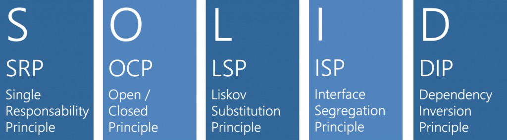

# S.O.L.I.D.
### Principios sólidos para finales flexibles

> "No caigas en la flexibilidad innecesaria."
>
> -- ✍️ **Steve Maguire-**

_Cuidado: recuerda el KISS 💋 vs YAGNI 🚫_

---

---

# S 🦄

## SRP : Single responsibility principle

**Principio de responsabilidad única.**
Un objeto solo debería tener una única responsabilidad, o razón para cambiar.

---

# O 🔐

## OCP : Open/closed principle

**Principio de abierto/cerrado.**
Las entidades de software deben estar abiertas para su extensión, pero cerradas para su modificación.

---

# L ⚛️

## LSP : Liskov substitution principle

**Principio de sustitución de Liskov.**
Los objetos deberían ser reemplazables por subtipos sin alterar el funcionamiento del programa.

---

# I 🤹

## ISP : Interface segregation principle

**Principio de segregación de la interfaz.**
Muchas interfaces específicas son mejores que una interfaz de propósito general.​

---

# D 🙃

## DIP : Dependency inversion principle

**Principio de inversión de la dependencia.**
Depender de abstracciones, no de implementaciones concretas. Resolver en ejecución usando la Inyección de Dependencias.

---

## 📝 Laboratorio

