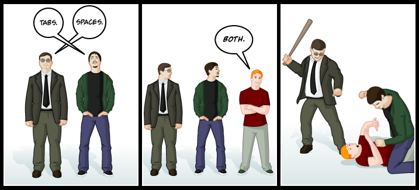

# Format

## Código bonito

> "Cada línea de código debe parecer escrita por la misma persona, sin importar el número de participantes."

---

## Belleza

> Algo que agrada a tus sentidos.

- Cualidad subjetiva.

- Características objetivas.

  - Sencillez.
  - Armonía.
  - Repetición.

---

- Belleza **horizontal**

  - Sangría en **bloques**
  - Espaciado en **expresiones**
  - Tamaño de las **líneas**

- Belleza **vertical**

  - **Orden** de las variables o propiedades
  - **Orden** de las funciones o métodos
        - público -> privado
        - newsletter

- Belleza **interna**

  - **Separadores** de listas e instrucciones
  - **Espacios** en las expresiones
        - alrededor de los paréntesis
        - alrededor de los operadores
  - **Delimitadores** de cadenas

> ¿Cuántas líneas en blanco seguidas **realmente** necesitas?

---

## Código con Reglas de Estilo

- **Decisión**: vamos a establecer reglas.
- **Opción**: vamos a fijar valores razonables.
- **Sentido**: vamos a incumplirlas... pero a sabiendas.

Define unas reglas y haz que se cumplan señalando lo que es incorrecto.

## Límites

- ✅80  - 120❌ _caracteres por línea_
- ✅1   -   2❌ _líneas pen blanco_
- ✅100 - 200❌ _líneas por fichero_

---

- Evita conflictos trasladando la decisión a otros:

  - [eslint-recommended](https://github.com/eslint/eslint/blob/master/conf/eslint-recommended.js)

---

- Herramientas de limpieza

  - [Prettier](https://prettier.io/)
  - [Beautify](https://www.npmjs.com/package/js-beautify)
  - Buscar según IDE y lenguaje.

> Aplicable a todo tipo de lenguajes.

---

> "El código limpio parece escrito por alguien a quien le importa"
>
> -- **Robert C. Martin**

### links

- [These tools will help you write clean code](https://www.freecodecamp.org/news/these-tools-will-help-you-write-clean-code-da4b5401f68e/)

- [Poetic](https://github.com/arianacosta/poetic)

- [Code guide for HTML & CSS](https://codeguide.co/)

- [12 Principles For Clean HTML Code](https://www.smashingmagazine.com/2008/11/12-principles-for-keeping-your-code-clean/)

- [Clean Code in SQL](https://riptutorial.com/sql/topic/9843/clean-code-in-sql)