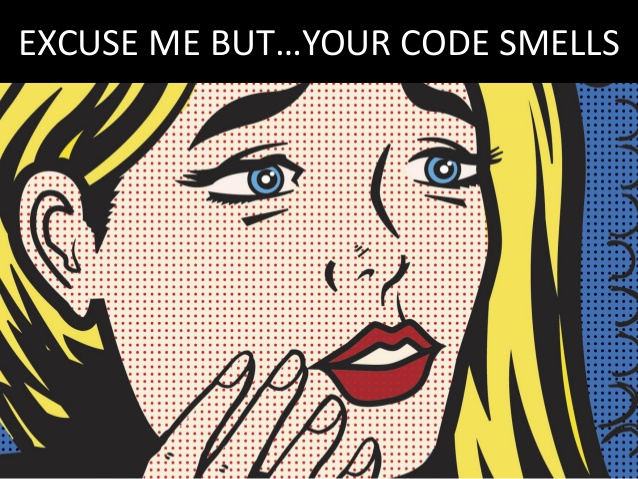

# 🤢 Perdona pero... tu código huele.

Lo primero es admitir que **todo código es mejorable.** El tuyo también; y el mío también.

Para no decir que está mal decimos que... huele mal.

---

> Perdone, le huele el código.

---

## 🥀 Con el tiempo empeora

El software exige mantenimiento. Así que con el paso del tiempo, digamos que el olor va a peor. El de los demás por supuesto, pero el tuyo también.

> "Cualquier código tuyo que no hayas mirado últimamente, es como si lo hubiese escrito otro."
>
> -- **Ley de Eagleson**

---

## 💈 Principios de mejora

Así que toca limpiarlo. Pero no de cualquier manera. Seguiremos unos **Principios de Limpieza**:

1. Mostrar la **intención** y ocultar los detalles.

2. **Evitar** la globalización y el acoplamiento.

3. Separar **responsabilidades**.

4. Don't Repeat Yourself **(DRY)**

...

5. Keep It Simple, (*not*) Stupid **(KISS)**

---

[¿Lo he puesto yo? ¿Estaba aquí? ... ](https://twitter.com/quinHD/status/1087817606923542528?s=20)
